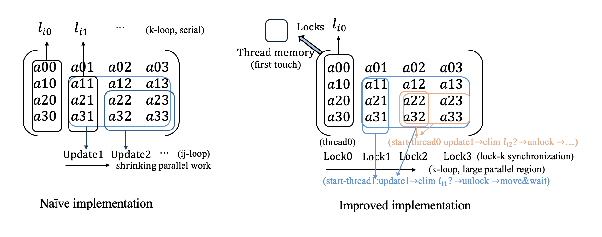

# LUDecompostition_HPP（High Performance Programming)
# Parallel LU Decomposition with Optimizations

This project implements LU decomposition (Doolittle’s method) in C, with both sequential and parallel versions. The parallel implementation uses OpenMP and includes several performance optimizations to address the overhead and limitations of naive parallelization. Performance is validated through correctness checks and timing comparisons.

## 🚀 Features

- ✅ Sequential baseline using row-major and column-major storage  
- ⚙️ Naive parallel version with OpenMP (`#pragma omp parallel for`)  
- ⚡ Optimized parallel implementation with major improvements:
  - Large parallel region across loop iterations (including outer loop over `k`)
  - First-touch memory allocation to improve data locality
  - Static cyclic column partitioning for better load balancing
  - Avoid serial bottlenecks in each iteration by restructuring loops
  - Fine-grained synchronization via OpenMP locks
  - Auto switch to serial execution when the lower triangle becomes small  
- ✅ Built-in correctness check: verifies that $LU \approx A$  
- 📈 Performance evaluation: time curve plotted and compared against naive version  

## 💡 Motivation

Naive parallelization of LU decomposition can lead to performance degradation due to:

- High overhead from frequent thread create/join (once per `k`)  
- Shrinking parallel workload per iteration  
- Serial section in each iteration (especially in loop over `k`)  
- Poor data locality due to irregular memory access  

This project improves on these issues by borrowing concepts from Gram-Schmidt Pthreads-style parallelization, leading to better scaling and efficiency.

## 📊 Performance

The optimized version shows a clear performance gain over the naive one, especially on larger matrices. A time-vs-size curve (notebook or figure included in the repo) illustrates this improvement.


## 📁 Structure

```
.
├── src/
│   ├── lu.c                 # Main source with all functions
├── test/                    # Test scripts and validation
├── plot/                    # Performance plots and analysis
└── README.md
```

## 🧪 How to Run

```bash
make
./lu 500 8 optimal
```

## ✅ Correctness

The program checks if the result of the LU decomposition satisfies:

$$ L \cdot U \approx A $$

with a small tolerance (epsilon = $10^{-9}$). Separate functions handle row-major and column-major matrix formats.

## 📌 Notes

- Avoids zero pivot with diagonally dominant matrices  
- Can be easily extended to support pivoting  
- Column-major storage allows better cache access on modern CPUs  

## 🤝 Acknowledgements

This project is a collaborative effort with support from Open Source resources and AI assistants, including ChatGPT and DeepSeek AI.
